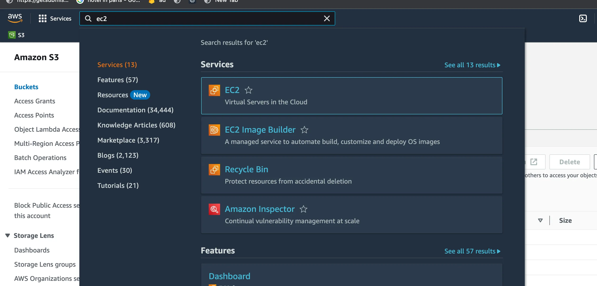
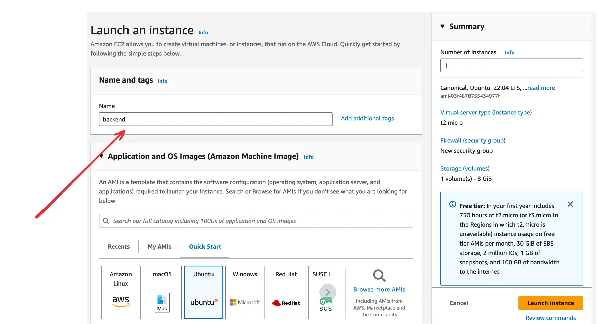
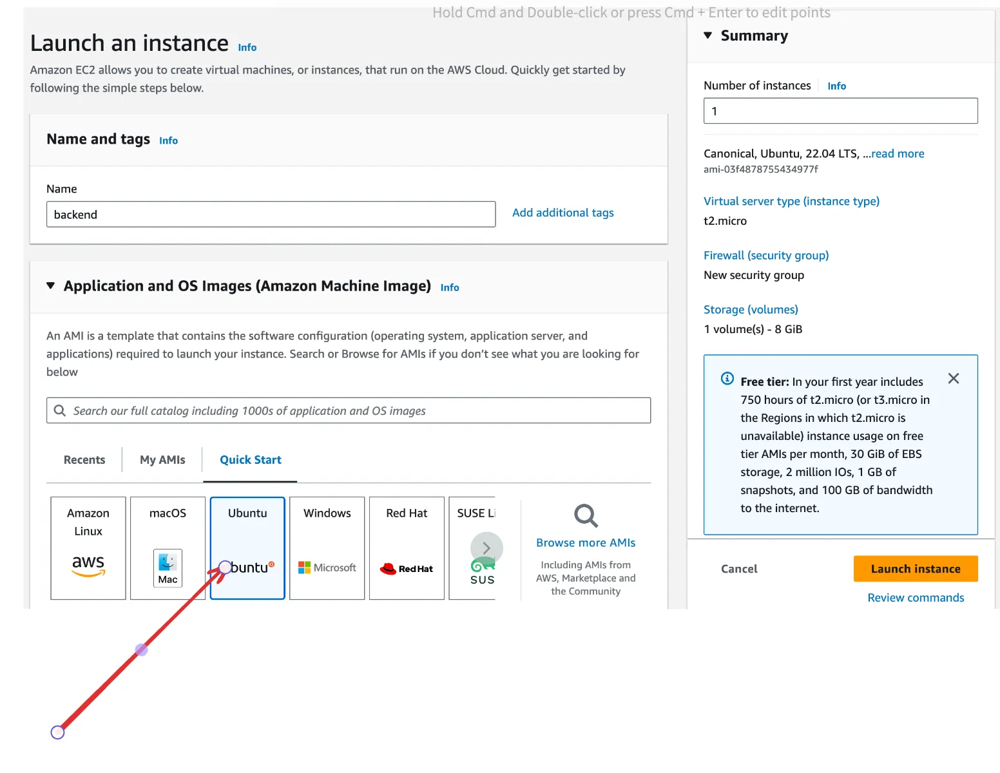
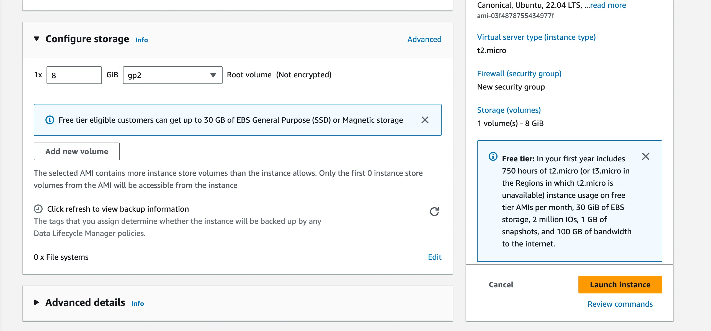

### **Why Do We Need to Use a Cloud Database to Deploy?**

1. **Accessing the App Remotely**:

   - When an app is run locally, it is only accessible within the local network because it does not have a **public IP address**.
   - Public IPs are unique and allow devices to be accessible over the internet. However, the number of public IPs is limited and expensive to own directly.

2. **Role of Cloud Providers**:

   - Cloud providers like **AWS**, **Azure**, and **Google Cloud** offer **public IPs** on a rental basis as part of their services.
   - These IPs are used to make your application or database available to users from anywhere in the world.

3. **Connecting to a Domain**:

   - A **domain name** can be linked to the public IP address of your app through **DNS (Domain Name System)**.
   - This makes it easier for users to access your app using a memorable domain name instead of an IP address (e.g., `www.example.com` instead of `192.168.x.x`).

4. **Why Cloud Databases Specifically?**:

   - **Reliability**: Cloud databases are maintained by providers to ensure high uptime and minimal data loss.
   - **Scalability**: As your app grows, cloud databases allow you to scale storage and performance effortlessly.
   - **Accessibility**: These databases are hosted on the internet, making them accessible from anywhere, unlike local databases tied to your personal machine or local network.

5. **Summary**:
   - Deploying on the cloud ensures your app has a **public IP** for global accessibility.
   - Cloud databases support this deployment by being accessible from any location while providing reliability, scalability, and ease of management.

### EC2 servers

- VMs on AWS are called EC2 Servers
- EC2 stands for Elastic compute Version 2.
- Elastic - Can increase/decrease the size of the machine
- Compute - It is a machine
- You can spin up a new EC2 instance from the aws dashboard

  

### Steps to create an EC2 server

1. Click on Launch a new instance

   

2. Give a name

   

3. Select an OS

   

4. Select an size

   

5. Create a new pair from which we can connect to that server from our local machine through the ip address

   

6. Select size

   

7. select that from where request will be comming http/https

   

### SSH into server

1. ssh into machine

```
ssh -i kirat-class.pem ubuntu@ec2-65-0-180-32.ap-south-1.compute.amazonaws.com
```

2. Exception case ( Give ssh key permissions )

   `IF error comes for some skeyecurity purpose of that file we get from aws key pair then run this command then run again that above code ^^`

```
chmod 700 kirat-class.pem
```
