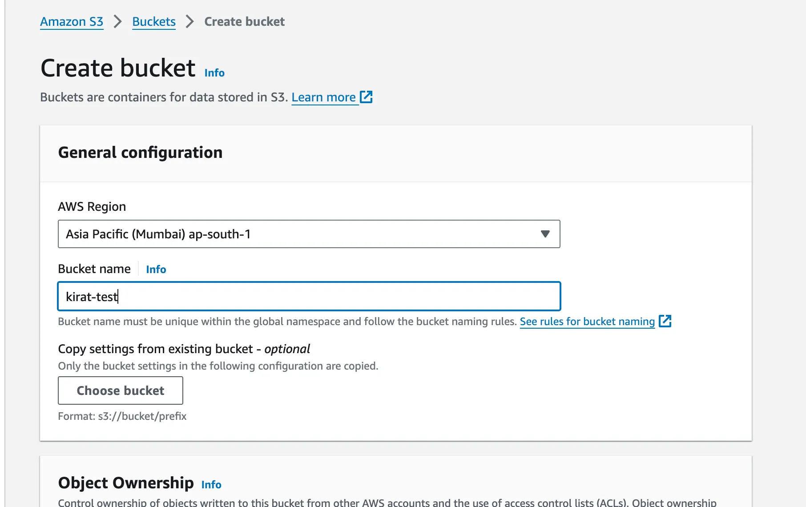

### How to Deploy Frontend on AWS

- New concepts we will learn:
  - **S3 (Simple Storage Service):** An object storage service for storing and retrieving any amount of data.
  - **CloudFront (CDN):** A content delivery network to deliver your content with low latency.

### Build Your Frontend App

- **Note:** This approach will not work for Next.js as it uses Server-Side Rendering (SSR).

1. **Navigate to your project directory.**
2. **Build your project using the following command:**

   ```nginx
   npm run build
   ```

3. **Serve the HTML/CSS/JS locally to test:**

   Install the `serve` package globally:

   ```nginx
   npm i -g serve
   ```

   Serve your project:

   ```nginx
   serve
   ```

   At this point, you have basic HTML/CSS/JS code that you can deploy on the internet. While you might be tempted to host this on an EC2 instance, using S3 and CloudFront is a more efficient approach.

### What are CDNs ?

- A CDN stands for Content Delivery Network.
  As the name suggests, it’s an optimal way for you to deliver content (mp4 files, jpgs and even HTML/CSS/JS files) to your users.

- It is better than serving it from a VM/EC2 instances because of a few reasons -

1. **EC2 machine apprach**

   

2. **CDN approach**

   

- For fronted, mp4 files, images, `object store` + `CDNs` are a better approcach
- You can’t use the same for backends, since every request returns a different response. Caching doesn’t make any sense there.

### Creating a object store in S3

- In AWS, S3 is their object store offering.
  You can create a bucket in there. A bucket represents a logical place where you store all the files of a certain project.





### Upload your file bundle in S3 (file & folder inside dist folder)


### Try accessing the website

- You might be tempted to open your S3 bucket at this point, but don’t
  Your S3 bucket should be blocked by default, and you should allow cloudfront (CDN) to access it.


### Connecting a cloudfront

1. Create a Cloudfront distribution

- Go to cloudfront and create a new distribution. A distribution here means you’re creating a place from where content can be distributed.


2. Select your S3 bucket as the source


`💡 Origin Access Control (OAC) is a feature in Cloudfront, which allows you to restrict direct access to the content stored in your origin, such as an Amazon S3 bucket or a web server, ensuring that users can only access the content through the CDN distribution and not by directly accessing the origin URL`

- By the end of this, you should have a working cloudfront URL.


