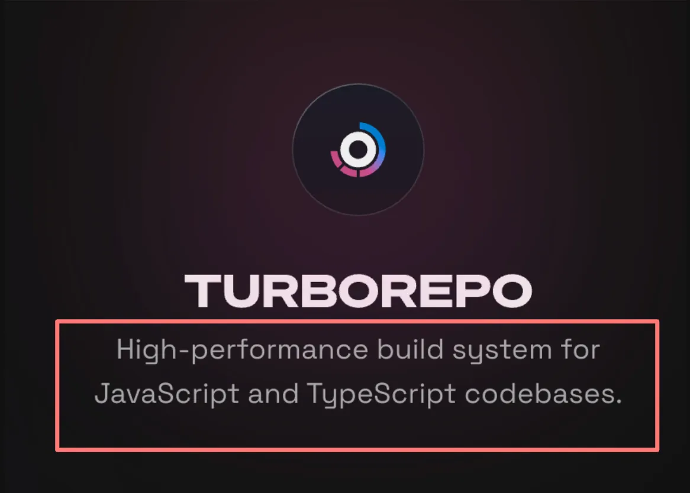
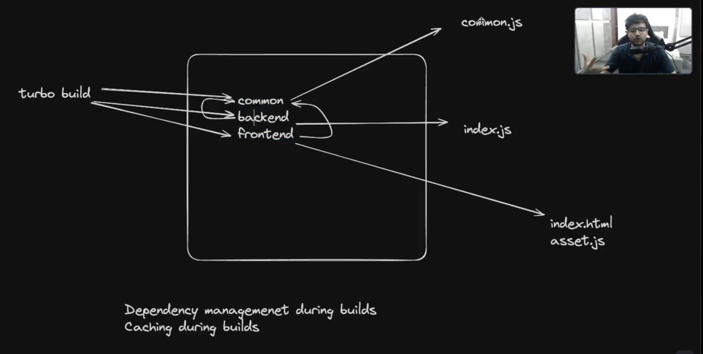
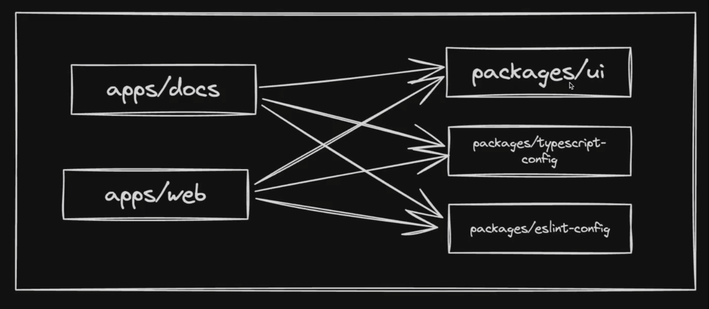

# Build system vs Build system orchestrator vs Monorepo framework





- Build System
  - A build system automates the process of transforming source code written by developers into binary code that can be executed by a computer. For JavaScript and TypeScript projects, this process can include transpilation (converting TS to JS), bundling (combining multiple files into fewer files), minification (reducing file size), and more. A build system might also handle running tests, linting, and deploying applications.
- Build System Orchestrator
  - TurboRepo acts more like a build system orchestrator rather than a direct build system itself. It doesn't directly perform tasks like transpilation, bundling, minification, or running tests. Instead, TurboRepo allows you to define tasks in your monorepo that call other tools (which are the actual build systems) to perform these actions.
    These tools can include anything from tsc, vite etc
- Monorepo Framework
  - A monorepo framework provides tools and conventions for managing projects that contain multiple packages or applications within a single repository (monorepo). This includes dependency management between packages, workspace configuration.

# Turborepo as a build system orchestrator

- Turborepo is a build system orchestrator .
- The key feature of TurboRepo is its ability to manage and optimize the execution of these tasks across your monorepo. It does this through:
- Caching: TurboRepo caches the outputs of tasks, so if you run a task and then run it again without changing any of the inputs (source files, dependencies, configuration), TurboRepo can skip the actual execution and provide the output from the cache. This can significantly speed up build times, especially in continuous integration environments.
- Parallelization: It can run independent tasks in parallel, making efficient use of your machine's resources. This reduces the overall time needed to complete all tasks in your project.
- Dependency Graph Awareness: TurboRepo understands the dependency graph of your monorepo. This means it knows which packages depend on each other and can ensure tasks are run in the correct order.

# Configuring tasks

- Turborepo will always run tasks in the order described in your turbo.json configuration and Package Graph, parallelizing work whenever possible to ensure everything runs as fast as possible. This is faster than running tasks one at a time, and it's a part of what makes Turborepo so fast.


# Initialize a TurboRepo

```
npx create-turbo@latest
```

# Explore the folder structure

- There are 5 modules in our project
- End user apps (websites/core backend)
  - apps/web - A Next.js website
  - apps/docs - A Docs website that has all the documentation related to your project
- Helper packages
  - packages/ui - UI packages
  - packages/typescript-config - Shareable TS configuration
  - packages/eslint-config - Shareable ESLine configuration

