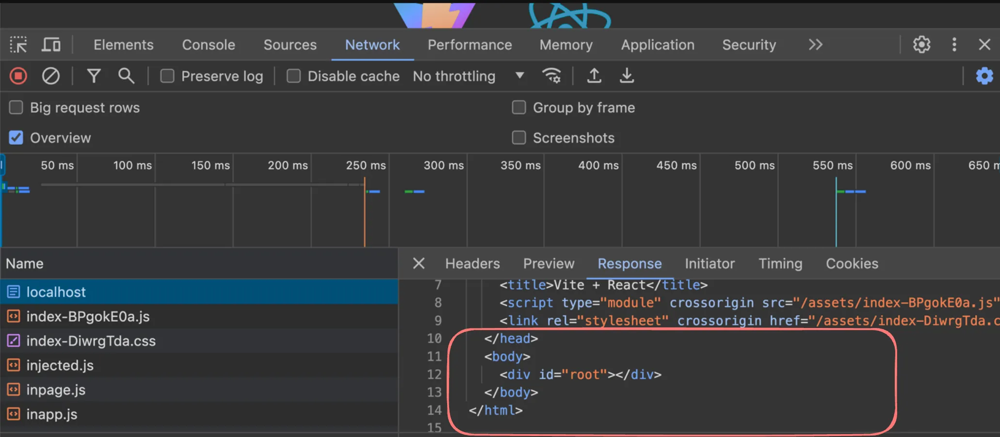
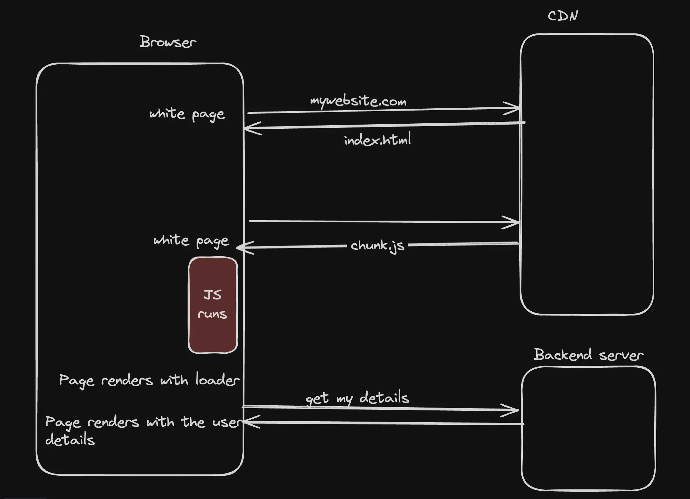
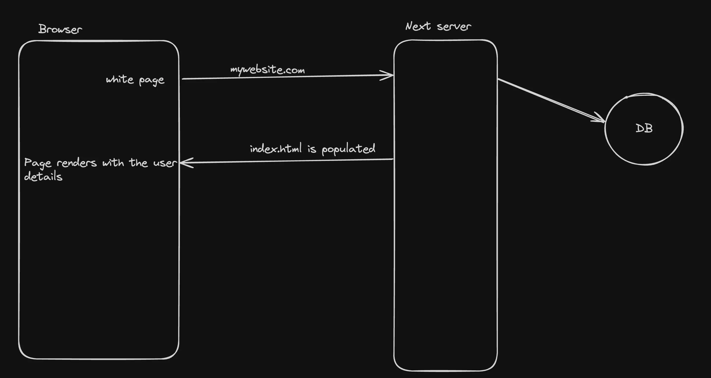
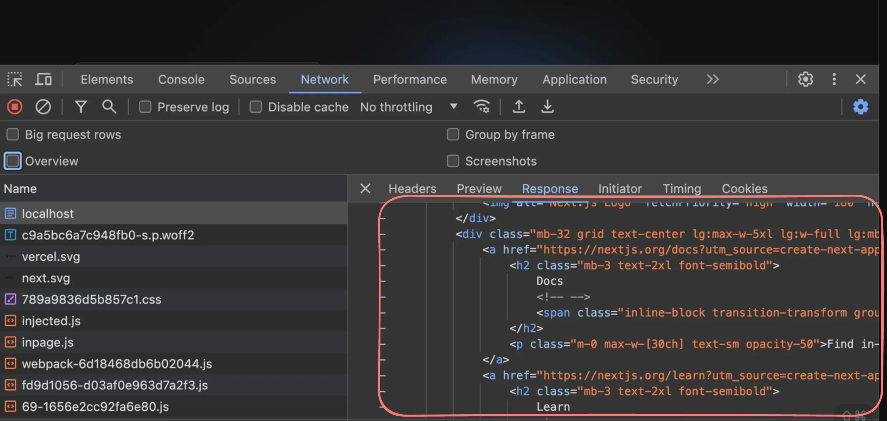

# Client Side rendering

- `Client-side rendering (CSR) is a modern technique used in web development where the rendering of a webpage is performed in the browser using JavaScript. Instead of the server sending a fully rendered HTML page to the client`


- Open the network tab and notice how the inital HTML file deosn’t have any content in a `React Project`



- This means that the JS runs and actually populates / renders the contents on the page
  React (or CSR) makes your life as a developer easy. You write components, JS renders them to the DOM.

# Downsides?

- Not SEO optimised
- User sees a flash before the page renders
- Waterfalling problem



# Server side rendering

- `When the rendering process (converting JS components to HTML) happens on the server, it’s called SSR`



- Why SSR?
  - SEO Optimisations
  - Gets rid of the waterfalling problem
  - No white flash before you see content



- Downsides of SSR?
  - Expensive since every request needs to render on the server
  - Harder to scale, you can’t cache to CDNs

# Static site generation

- Ref https://nextjs.org/docs/app/building-your-application/data-fetching/fetching-caching-and-revalidating

- `If a page uses Static Generation, the page HTML is generated at build time. That means in production, the page HTML is generated when you run next build. This HTML will then be reused on each request. It can be cached by a CDN.`

- Why?

  - If you use static site generation, you can defer the expensive operation of rendering a page to the build time so it only happens once.

- How?

  - Let’s say you have an endpoint that gives you all the global todos of an app.
    By global todos we mean that they are the same for all users, and hence this page can be statically generated.
    https://sum-server.100xdevs.com/todos

- Create todos/page.tsx

```
export default async function Blog() {
    const res = await fetch('https://sum-server.100xdevs.com/todos')

    const data = await res.json();
    const todos = data.todos;

    console.log("todos", );
    return <div>
        {todos.map((todo: any) => <div key={todo.id}>
            {todo.title}
            {todo.description}
        </div>)}
    </div>

}
```

- Clear cache every 10 seconds

```
const res = await fetch('https://sum-server.100xdevs.com/todos', {
    next: { revalidate: 10 }
});

```

- clear cache in a next action
  import { revalidateTag } from 'next/cache'

```
import { revalidateTag } from 'next/cache'

const res = await fetch('https://sum-server.100xdevs.com/todos', { next: { tags: ['todos'] } })
```

```
'use server'

import { revalidateTag } from 'next/cache'

export default async function revalidate() {
  revalidateTag('todos')
}
```
