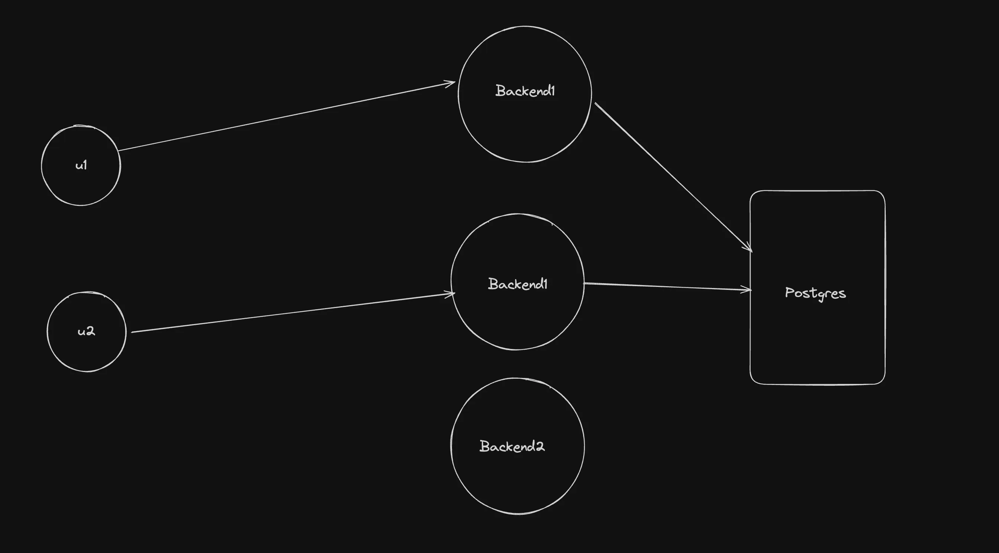
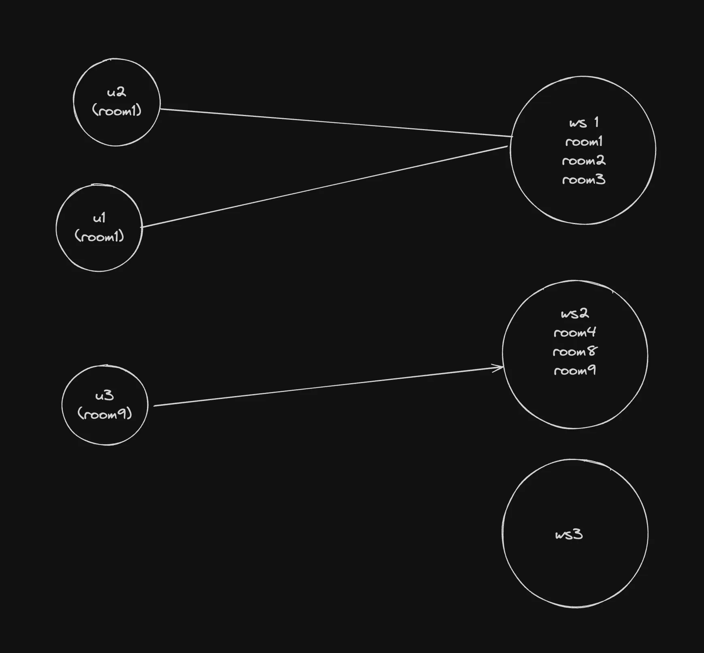
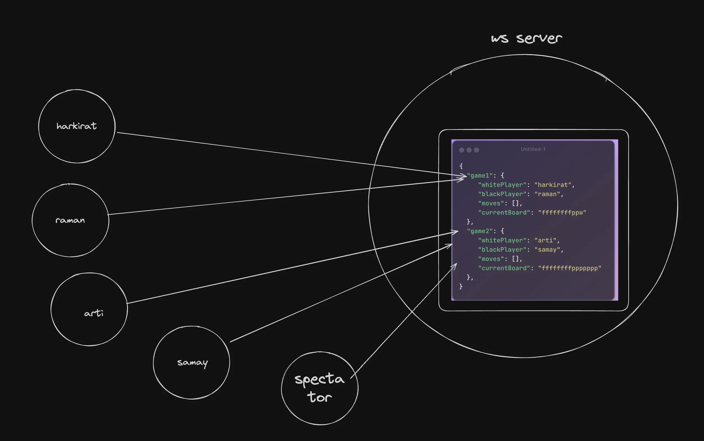

# What we learning

- Stateful vs Stateless Backends
- State management in a Backned app
- Singleton Pattern
- Pub Subs + Singleton pattern

# Stateless Servers

- Stateless servers
  Usually when you write HTTP servers, they dont hold any state
  This means, they don’t have any in memory variables that they use
  They usually rely on the database for state

### Advantages

1. Users can connect to a random server, there is no need of stickiness
2. Can autoscale up and down easily and simply decide where to route traffic based on CPU usage.

# Stateful Servers

- A lot of times servers store in memory variables like real-time games (bgmi, chess) where we need the output in a fraction of seconds, where a backend call takes a lot of time to give output. To remove the latency stateful servers are used.

1. Creating an in memory cache - `https://github.com/code100x/cms/blob/e905c71eacf9d99f68db802b24b7b3a924ae27f1/src/db/Cache.ts#L3`
2. Storing the state of a Game in case of a realtime game - `https://github.com/code100x/chess/blob/main/apps/ws/src/Game.ts#L41-L47`
3. Storing a list of 10 most latest chats in memory for a chat application

### Stickiness

- It means 100 player playing bgmi should connect to the same server means it stick to that server only, that should help stateful for real-time updates
- Making sure that the user who is interested in a specific room, gets connected to a specific server.

# state in JS Process

- How we can store state in a js process

- The state might being used by multiple files, not just one, so the following approach might not work

# classes and singleton pattern