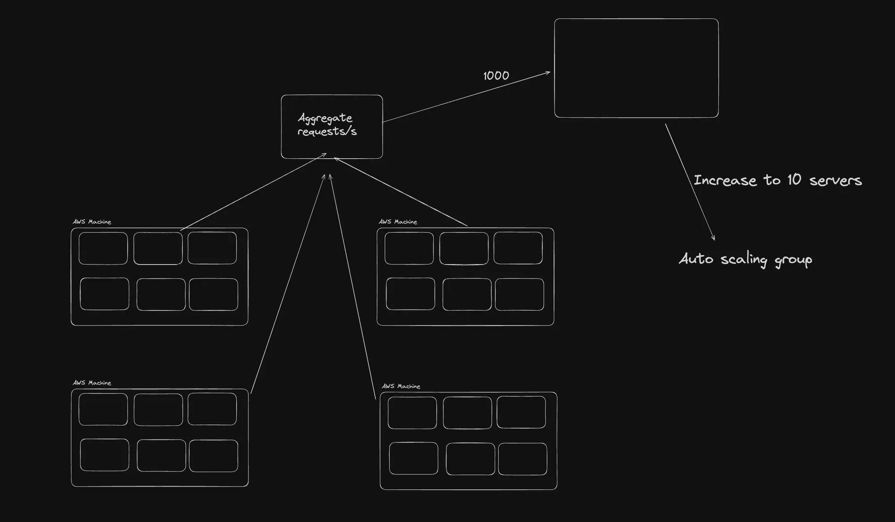
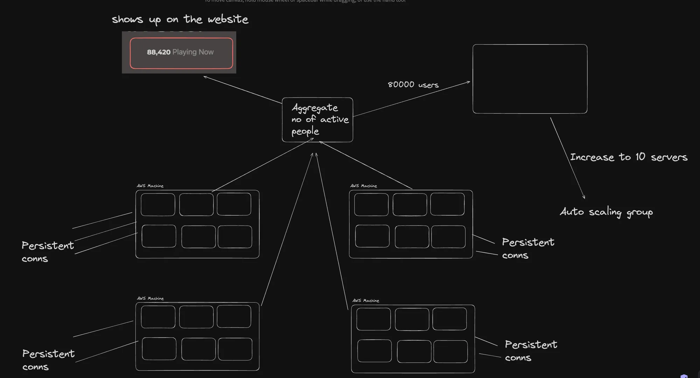

## What we’re discussing

### Server

    - Cluster module and horizontal scaling ✅
    - Capacity Estimation

## Vertical scaling

- Vertical scaling means increasing the size of your machine to support more load


### Single threaded languages


###

### Single threaded languages


## Node.js

- Let’s run an infinite loop in a JS project and see how our CPU is used

```
let c = 0;
while (1) {
  c++;
}
```


- This confirms that only a single core of the machine is being used. We got 3 different processes using 100% CPU each.

## Rust

```
use std::thread;

fn main() {
    // Spawn three threads
    for _ in 0..3 {
        thread::spawn(|| {
            let mut counter: f64 = 0.00;
            loop {
                counter += 0.001;
            }
        });
    }

    loop {
        // Main thread does nothing but keep the program alive
    }
}
```


- But in rust we see one process taking 400% of the CPU core as rust/java/go is a multi-threaded language but usually it not work on multi-threaded we have to write the code to use multi-threading.

## Implementing a Vertical Scaling in Node.js project with cluster Module

- We can start bunch of node.js and each process taking 100% of 1 core so if we start 8 processes then we can use 8 cores.

```
node index.js
node index.js
node index.js
node index.js
node index.js
node index.js
node index.js
node index.js
```

- This, ofcourse has a lot of problems
  - Just ugly to do this, keep track of the processes that are up and down
  - Processes will have port conflicts, you’ll have to run each process on a saparate port

## Capacity Estimation

- Capacity estimation is a critical aspect of system design, especially when planning for scalability and reliability. In a system design interview, you may be asked how you would scale your server, handle traffic spikes, and support a certain Service Level Agreement (SLA) given specific traffic conditions. This section will elaborate on these points and explain the attached architecture diagrams in detail.

## `How Would You Scale Your Server?`

- Scaling a server involves increasing its capacity to handle more load. There are two primary methods of scaling:

1. Vertical Scaling (Scaling Up): Increasing the resources (CPU, RAM, storage) of a single server. This approach is limited by the maximum capacity of the hardware.
2. Horizontal Scaling (Scaling Out): Adding more servers to distribute the load. This approach is more flexible and can handle larger increases in traffic

## `How Do You Handle Spikes?`

- Handling traffic spikes requires a dynamic approach to scaling. Here are some strategies:

1. Auto Scaling: Automatically adding or removing servers based on the current load. This ensures th at the system can handle sudden increases in traffic without manual intervention.
2. Load Balancing: Distributing incoming requests across multiple servers to ensure no single server is overwhelmed.
3. Caching: Storing frequently accessed data in a cache to reduce the load on the servers.

## `How Can You Support a Certain SLA Given Some Traffic?`

- Supporting a specific SLA (e.g., 99.9% uptime) requires careful planning and monitoring:

1. Redundancy: Having multiple servers and data centers to ensure that if one fails, others can take over.
2. Monitoring and Alerts: Continuously monitoring the system's performance and setting up alerts for any issues.
3. Capacity Planning: Estimating the required capacity based on current and projected traffic and ensuring that the system can handle it.

## `Paper Math for Capacity Estimation`

- Capacity estimation often involves some basic calculations:

1. Estimating Requests per Second (RPS): Based on the number of users and their activity patterns.
2. Determining Machine Capacity: Estimating how many requests a single machine can handle based on its specifications and the nature of the workload.
3. Auto Scaling: Setting up rules to add or remove machines based on the load.

# Example 1: PayTM App

- For a payment app like PayTM, you need to handle a large number of transactions per second, especially during peak times like sales or festivals. The architecture might include:

1. Auto Scaling Groups: To handle varying loads.
2. Load Balancers: To distribute traffic.
3. Database Sharding: To manage large volumes of transaction data.



### Aggregate Requests and Auto Scaling

- This diagram shows a system designed to handle aggregate requests with auto-scaling capabilities:

1. Aggregate Requests: The system aggregates incoming requests.
2. Auto Scaling Groups: These groups dynamically scale the number of servers based on the load.
3. Auto Machines: Individual processing units that handle the requests. The system can increase the number of these machines to handle higher loads, up to 10 servers

# Example 2: Chess App

- For a chess app, the focus might be on real-time interactions and maintaining game state. The architecture might include:

1. WebSockets: For real-time communication.
2. Auto Scaling: To handle peak times when many users are playing simultaneously.
3. Persistent Connections: To maintain game state and player interaction



### Aggregate Number of Active People

- This diagram focuses on tracking the number of active users and scaling accordingly:

1. Aggregate Number of Active People: The system tracks the number of active users, shown as 90,000 users.
2. Persistent Connections: Each server maintains persistent connections with users.
3. Auto Scaling Groups: The system can increase the number of servers to handle the load, up to 10 servers.
4. Playing Now Metric: Shows the number of users currently active, e.g., 88,420.

`Capacity estimation involves understanding the current and projected load, determining the capacity of individual machines, and setting up auto-scaling to handle varying traffic. By using techniques like load balancing, caching, and redundancy, you can ensure that your system meets its SLA and handles traffic spikes effectively. The provided diagrams illustrate how auto-scaling and persistent connections can be used to manage large numbers of requests and active users.`
