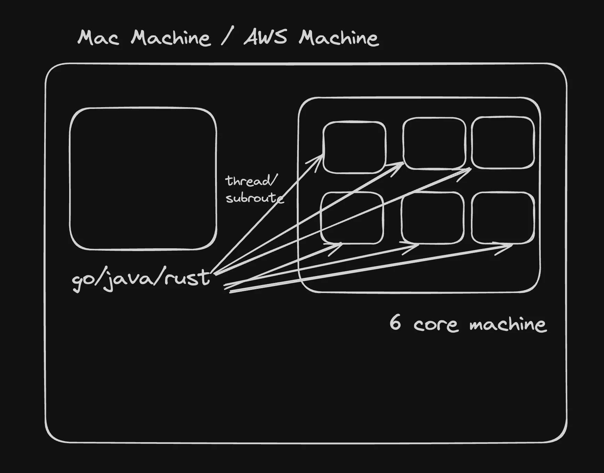
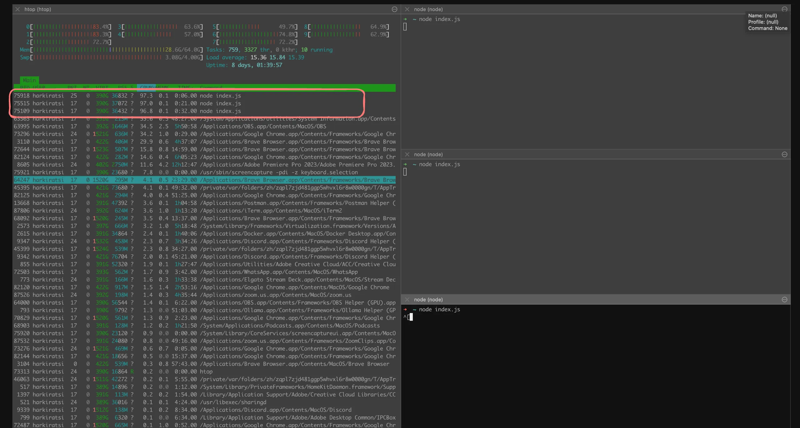

## What we’re discussing

### Server

    - Cluster module and horizontal scaling ✅
    - Capacity Estimation, ASGs and Vertical scaling ✅
    - Load balancers ✅

### Database

    - Indexing ✅
    - Normalization
    - Sharding

## Vertical scaling

- Vertical scaling means increasing the size of your machine to support more load

### Single threaded languages


###

### Single threaded languages



## Node.js

- Let’s run an infinite loop in a JS project and see how our CPU is used

```
let c = 0;
while (1) {
  c++;
}
```



- This confirms that only a single core of the machine is being used. We got 3 different processes using 100% CPU each.

## Rust

```
use std::thread;

fn main() {
    // Spawn three threads
    for _ in 0..3 {
        thread::spawn(|| {
            let mut counter: f64 = 0.00;
            loop {
                counter += 0.001;
            }
        });
    }

    loop {
        // Main thread does nothing but keep the program alive
    }
}
```


- But in rust we see one process taking 400% of the CPU core as rust/java/go is a multi-threaded language but usually it not work on multi-threaded we have to write the code to use multi-threading.
